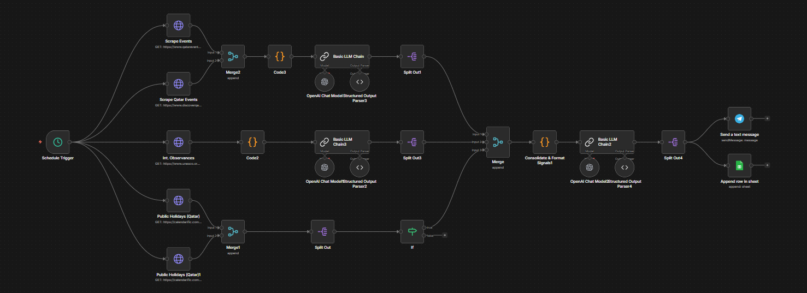
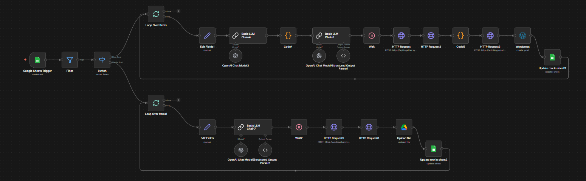

# Event-Based Idea & Blog Automation (n8n)

An AI-powered event-driven content automation workflow built in n8n that automatically collects Qatar events, international observance days, public holidays, and trending topics, generates prioritized social media ideas & blog content using AI, creates visual prompts, and publishes structured content to Google Sheets and WordPress.

---

## 📌 Overview

This project builds a fully automated weekly content engine for a Qatar-based tourism and lifestyle brand.

The workflow:

- Collects Qatar events from event websites  
- Fetches international observance days  
- Retrieves Qatar public holidays  
- Uses AI to prioritize and select the most relevant items  
- Generates 6 high-quality social media ideas  
- Creates blog-ready long-form content  
- Produces AI image prompts  
- Publishes blog posts to WordPress  
- Stores and updates all outputs in Google Sheets  

The entire system runs automatically on schedule.

---

## 🏗️ Workflow Architecture

### 🔹 Phase 1 – Signal Collection (Multi-Branch)

- Schedule Trigger (Weekly automation)  
- Scrape Events (HTTP Request)  
- Scrape Qatar Events  
- International Observances API  
- Qatar Public Holidays API  
- Merge Nodes (Combine all signals)  
- Code Nodes (Normalization & Categorization)  

Each signal is categorized as:
- `QatarEvent`  
- `ObservanceDay`  
- `PublicHoliday`  

---

### 🔹 Phase 2 – AI Prioritization & Content Generation

- Consolidate & Format Signals  
- LLM Chain (Priority-Based Selection)  
- Structured Output Parser  
- Split Items (Top 6 Selected Posts)  

The AI:

- Scores items by relevance, category priority & proximity  
- Selects top 6 signals  
- Generates:
  - IdeaTitle  
  - IdeaDescription  
  - CaptionEN (60–90 words)  
  - CaptionAR (short line)  
  - Hashtags  
  - SuggestedPostDateTime  
  - ImageIdeas  
  - SourceURL  
  - UTM  

---

### 🔹 Phase 3 – Storage & Weekly Distribution

- Append Rows in Google Sheets  
- Send Summary Notification  
- Maintain structured content database  

Google Sheets acts as the master weekly content repository.

---

### 🔹 Phase 4 – Blog & Visual Automation (Triggered on New Row)

#### 📝 Blog Branch

- Generate blog content via LLM  
- Refine structure & SEO  
- Generate metadata  
- Publish to WordPress via API  
- Update Sheet with live blog URL  

#### 🎨 Image Branch

- Generate poster-style AI image prompt  
- Call Image Generation API  
- Upload media to Google Drive  
- Update Sheet with image link  

---

## 🔄 Workflow Visual

---

## 🧠 How It Works

### 1️⃣ Weekly Signal Gathering

The workflow runs on schedule and gathers:

- Upcoming Qatar events  
- International observance days  
- Public holidays  
- Trending global topics  

All signals are normalized into structured JSON objects.

---

### 2️⃣ Smart Selection & Prioritization

AI ranks items using:

- Category priority  
- Date proximity  
- Relevance to eco-tourism & adventure  
- Content potential  

Only the top 6 high-scoring signals are selected.

---

### 3️⃣ Social Media Pack Generation

For each selected item, AI generates:

- Post Title  
- Idea Description  
- English Caption  
- Arabic Caption  
- Hashtags  
- Suggested Posting Time  
- Image Concept  

All data is appended into Google Sheets.

---

### 4️⃣ Automated Blog Publishing

When a new row is added:

- AI generates long-form blog article  
- Applies SEO-friendly structure  
- Publishes to WordPress  
- Updates Sheet with live blog link  

---

### 5️⃣ AI Image Creation

For each idea:

- AI generates a clean poster-style visual prompt  
- Calls image generation API  
- Uploads image to Google Drive  
- Updates Sheet with asset link  

---

## 🛠️ Tech Stack

- n8n (Workflow Automation)  
- OpenAI (Chat + Structured Output)  
- Google Sheets API  
- Google Drive API  
- WordPress REST API  
- Google Trends JSON API  
- HTTP Scraping  
- Scheduled Automation  

---

## 🔐 Required Credentials

Configure the following in n8n:

- OpenAI API Key  
- Google Sheets OAuth  
- Google Drive OAuth  
- WordPress API Credentials  
- Event/Observance APIs (if applicable)  

---

## ✅ Features

- Multi-source event aggregation  
- AI-based signal prioritization  
- Automated 6-post weekly social pack  
- Structured JSON content generation  
- Bilingual caption creation (EN + AR)  
- Auto blog generation & publishing  
- AI image prompt generation  
- Google Drive media storage  
- Google Sheets as content database  
- Fully automated weekly execution  
- Modular multi-branch architecture  

---

## 🎯 Use Cases

- Tourism & travel brands  
- Event-driven marketing teams  
- Content marketing automation  
- AI-powered blog publishing systems  
- Social media scheduling pipelines  
- Portfolio-grade AI automation project  
